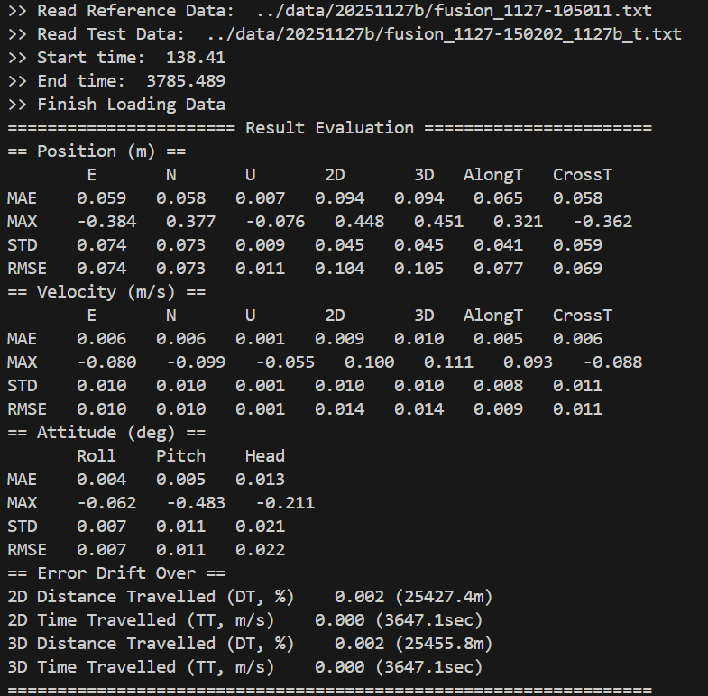
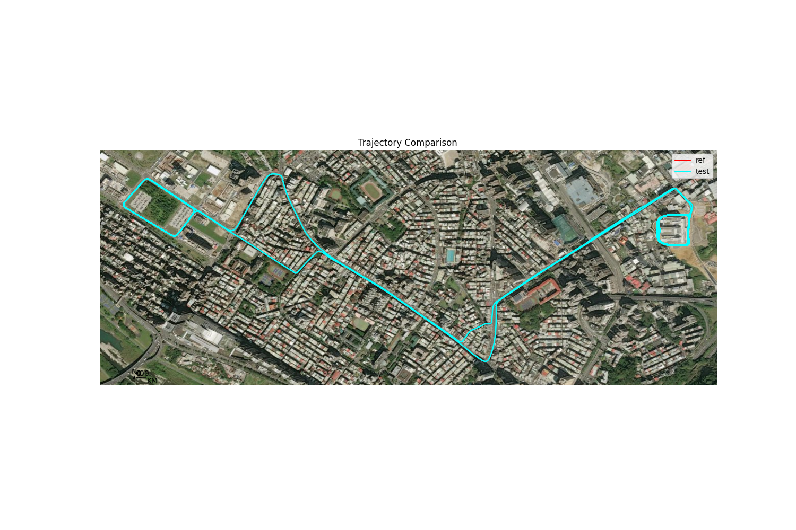
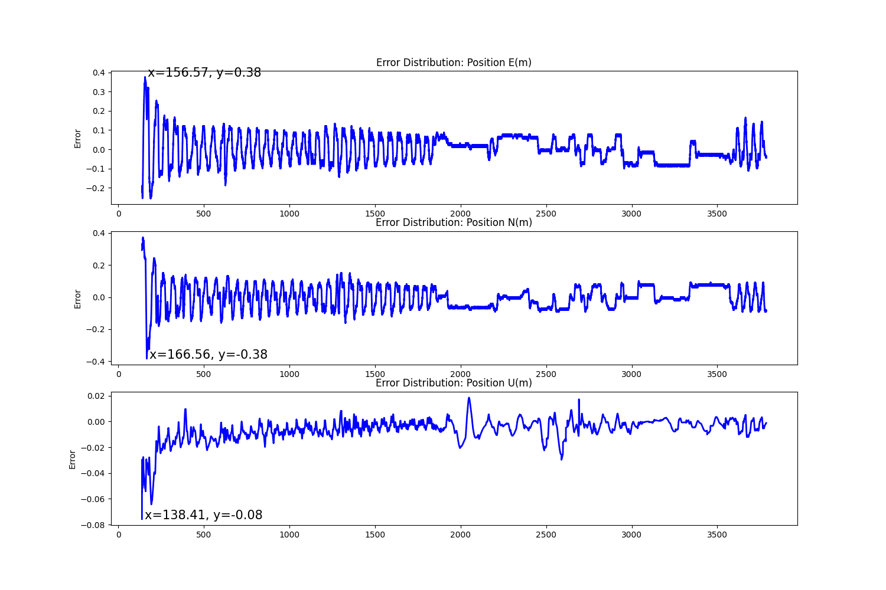
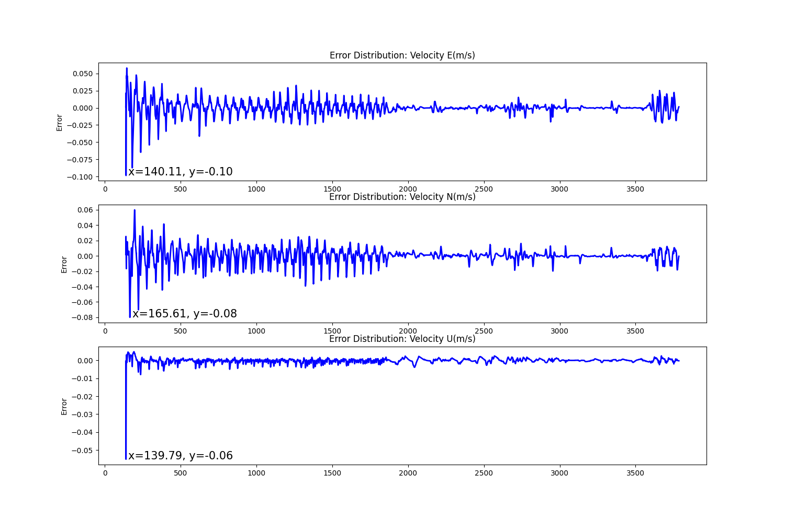
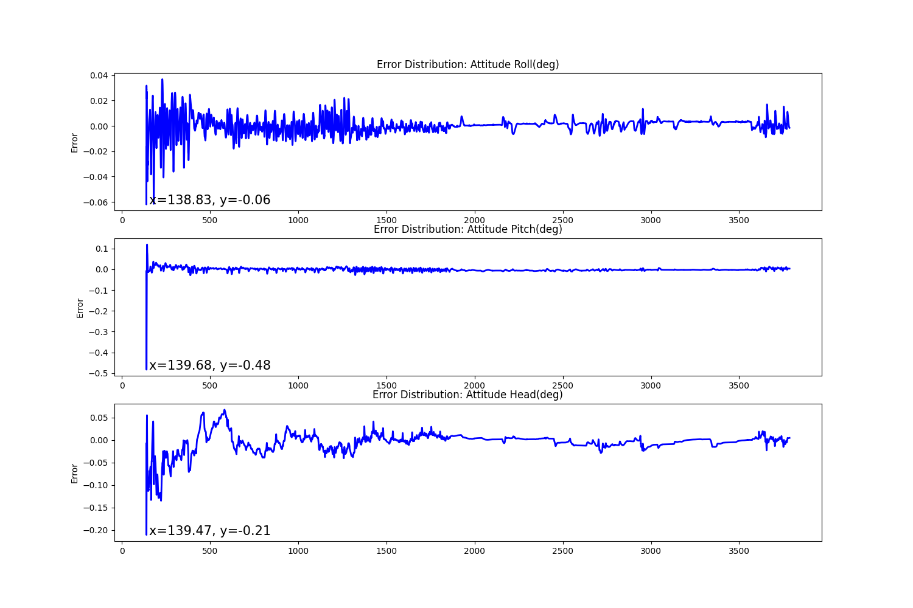

# traj_pva_analysis


## Introduction
This is a Python toolkit designed to analyze localization performance by comparing position, velocity, and attitude between ground truth and the tested trajectory.

<!-- TABLE OF CONTENTS -->
<details open="open" style='padding: 10px; border-radius:5px 30px 30px 5px; border-style: solid; border-width: 1px;'>
  <summary>Table of Contents</summary>
  <ol>
    <li>
      <a href="#result">Result</a>
    </li>
    <li>
      <a href="#run">Run</a>
    </li>
    <li>
      <a href="#config">Config</a>
    </li>
  </ol>
</details>


<a name="result"></a>
## Result

The evaluation benchmarks include position, velocity, and attitude errors, with metrics such as Mean Absolute Error (MAE), maximum error (MAX), standard deviation (STD), and Root Mean Square Error (RMSE). To assess the performance of the tested trajectory, errors are analyzed not only in the global ENU frame, but also decomposed into along-track and cross-track components.

<p align='center'>
    
</p>

For data collected in tunnel scenarios, test segments without GNSS updates can be extracted. Localization error drift is evaluated with respect to both elapsed time and traveled distance.

The tested trajectory is compared against ground-truth data through trajectory visualizations. In addition, position, velocity, and attitude errors are plotted over time to facilitate temporal error analysis.

<p align='center'>
    
    
    
    
</p>

<a name="run"></a>
## Run
1. Download the whole project, and change the `./src/config_for_cal.ini` settings.
2. Execute the code.

```
cd src
python3 cal_data.py
```

<a name="config"></a>
## Config

For the config settings, please refer to the following example.

```ini

[Files]
GroundTruth = ../data/20251127b/fusion_1127-105011.txt
TestData = ../data/20251127b/fusion_1127-150202_1127b_t.txt

[CompareTime]
startTime = 138.410000  # evaluation start time based on GPSTime
endTime = 3785.489000  # evaluation end time based on GPSTime
tunnel_length = 564  # Please insert the tunnel length, otherwise leave it 1 

[Interpolation]
method = linear

[Comparison]
Position = 1  # flag to activate position evaluation
Velocity = 1  # flag to activate velocity evaluation
Attitude = 1  # flag to activate attitude evaluation

[Output]
Output_path = ../fig/
Output_fig = 1  # flag to activate output figure
```
